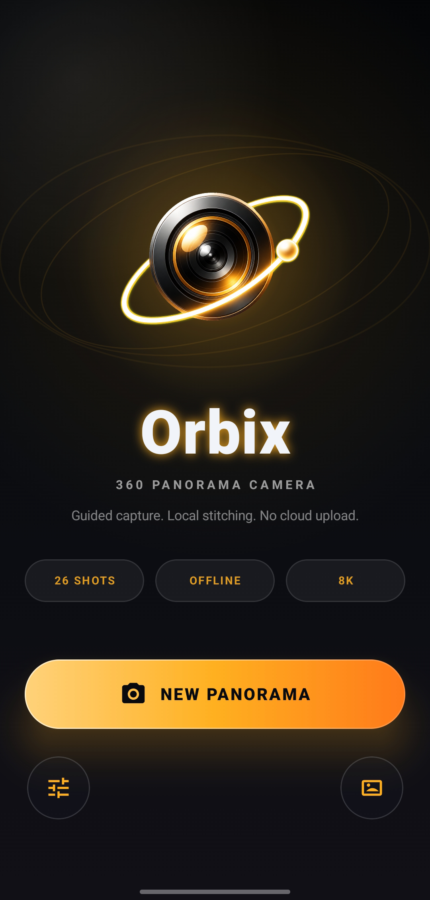
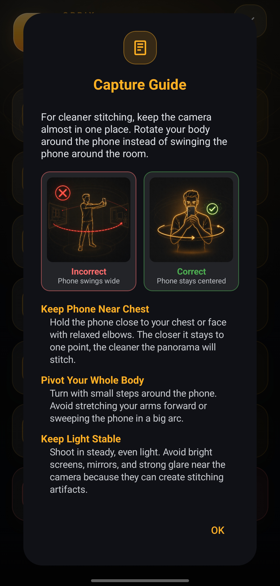
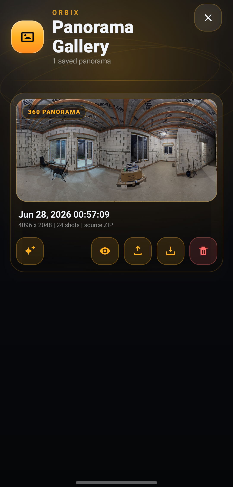
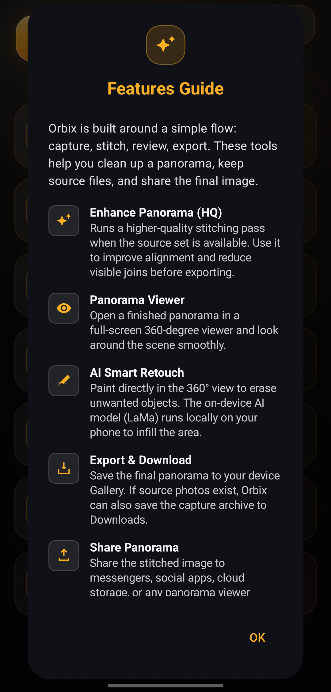
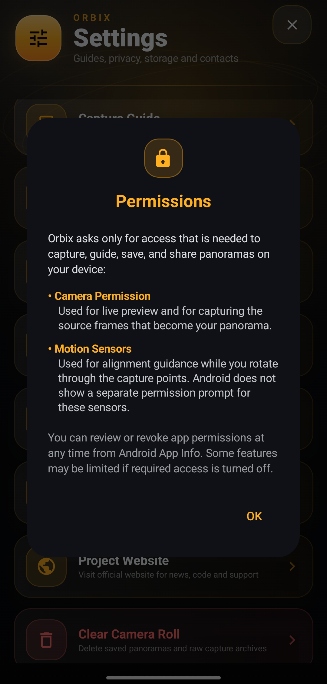
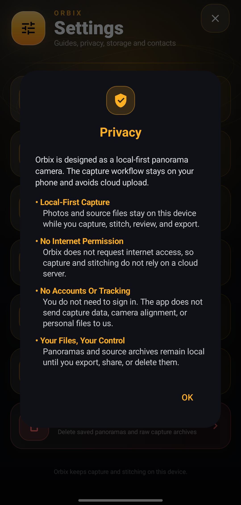
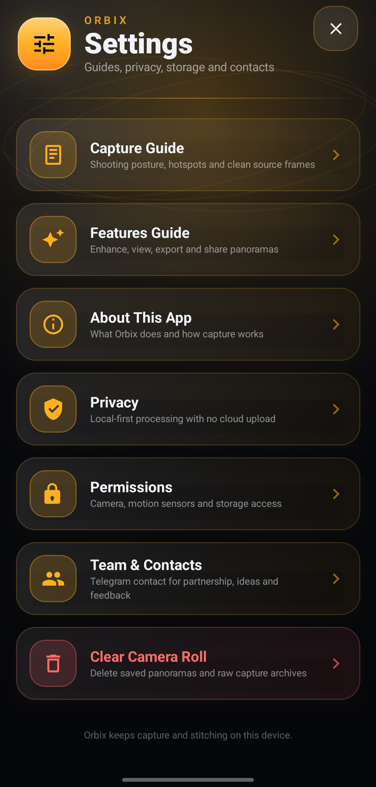
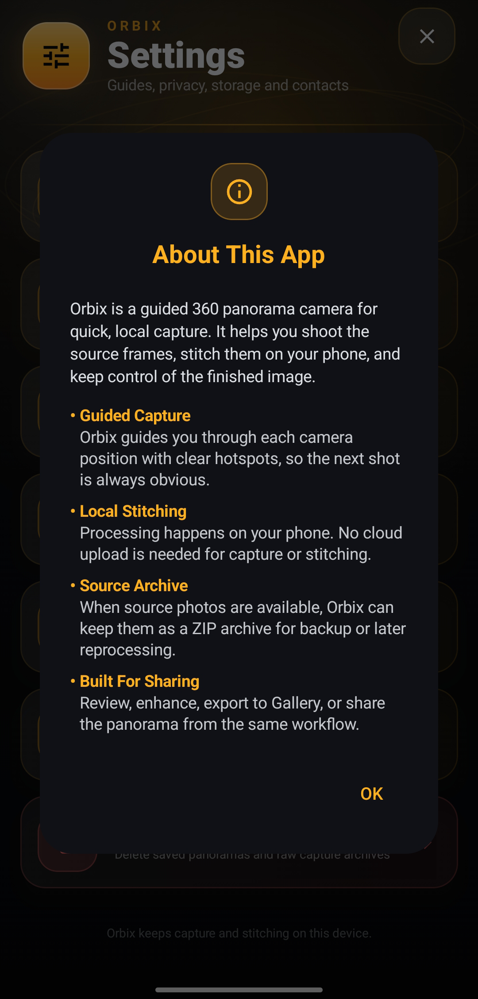
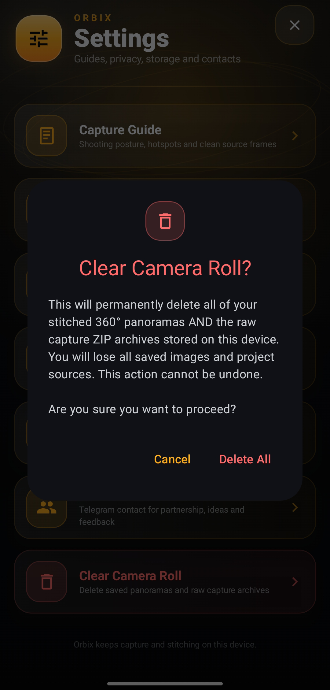
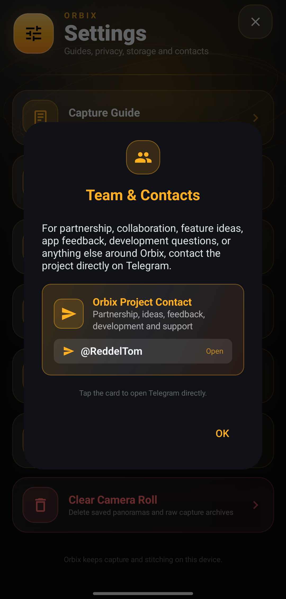

# Orbix — 360° Panorama Camera for Android

[-green.svg)](https://developer.android.com)
[](#privacy)

**Orbix** is a powerful, offline-first native Android application designed for capturing and stitching high-resolution 360-degree spherical panoramas directly on your device. The app guides you through a 26-hotspot sphere grid using real-time motion sensors, records the frames, and processes them locally without requiring any internet connection.

This repository hosts the source code for the **Orbix Promotional Landing Page** (deployed via GitHub Pages) and the **compiled APK releases**.

---

## 📸 App Screenshots

### Core Capture & Main Workflow
| Start Screen | Guided Capture Grid | Panorama Gallery | Features Guide | Permissions Details |
|:---:|:---:|:---:|:---:|:---:|
|  |  |  |  |  |

### Additional Screens & Settings
| Privacy Overview | Settings & Info | About Orbix | Clear Camera Roll | Team & Contacts |
|:---:|:---:|:---:|:---:|:---:|
|  |  |  |  |  |

---

## 🚀 Key Features

* **Guided Sphere Grid**: Real-time sensor guidance with a 26-hotspot overlay helps you align every photo perfectly for complete spherical coverage.
* **Dual-Mode Local Stitching**: 
  * **Quick Preview**: Instantly generates a fast, high-resolution panorama right after capture so you can review your scene immediately.
  * **High-Quality Enhancement**: Automatically runs an advanced blending pass locally to refine alignments, smooth seams, and erase gaps for a flawless result.
* **Interactive 360° Viewer**: Instantly explore your captured panoramas in a full-screen spherical viewer with smooth touch controls or device motion tracking.
* **Smart Export & Backup**: Save standard equirectangular photos with complete 360° metadata (fully compatible with Google Photos and VR headsets) or back up the original source photos in a ZIP archive.

---

## 🔒 Privacy First

* **Zero Telemetry / No Cloud**: The app does **not** declare the `INTERNET` permission in its `AndroidManifest.xml`.
* **100% Offline**: All images are captured, processed, and stored entirely on your device's local storage.
* **Manual Export Only**: Saved files are only shared when you choose to export them manually using the system share sheet.
* **Verifiable Security**: Anyone can inspect the compiled APK file (using static analysis tools like `jadx` or network traffic monitors) to verify that the application has zero network capabilities, collects no telemetry, and does not transmit data.

---

## 📦 How to Install APK

Since the project source code is kept private, you can download the ready-to-run compiled production APK directly from the repository.

1. Go to the [GitHub Releases](https://github.com/rohacode/Orbix/releases) page.
2. Download the latest `orbix-v1.0-release.apk`.
3. Open the downloaded file on your Android device.
4. If prompted, allow installation from "Unknown Sources" for your browser or file manager.
5. Launch **Orbix** and grant the Camera and Motion Sensor permissions to begin capturing!

---

## 💻 About this Landing Page

The landing page (contained in the root of this repository) features:
* **Rich Visual Design**: Immersive glassmorphic panes, responsive symmetrical grid, and dynamic gradients.
* **Interactive Stars Background**: Amber-gold floaty particle engine running on an HTML5 canvas.
* **Crypto Donation Modal**: Dynamic cryptocurrency address selector generating on-the-fly QR codes (integrated via `qrcode.min.js`).

### File Structure
```text
├── assets/             # Logos, favicons, and processed SVGs
├── css/
│   └── style.css       # Symmetrical layouts, glassmorphism, and responsive CSS
├── js/
│   ├── donation-modal.js   # Modal controls and QR generator logic
│   ├── donation-wallets.js # Configured public wallet addresses
│   └── particles.js        # Floating canvas animation
├── Screenshots/        # App interface previews
├── index.html          # Main HTML5 document
└── README.md           # This document
```

---

## 📄 License

All rights reserved. The website design, code, assets, and the Orbix application are the proprietary property of the author. Unauthorized copying, modification, or redistribution is prohibited.
